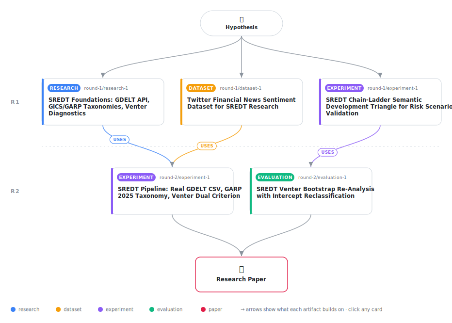

# Semantic Risk Evidence Development Triangles: Actuarial Chain-Ladder Projection for LLM Corporate Risk Scenario Validation

<div align="center">

<a href="https://cdn.jsdelivr.net/gh/AMGrobelnik/ai-invention-8ea2f1-semantic-risk-evidence-development-trian@main/workflow.svg">
<picture>
  <source media="(prefers-color-scheme: dark)" srcset="workflow-dark.svg">
  
</picture>
</a>

<sub>🖱️ <b><a href="https://cdn.jsdelivr.net/gh/AMGrobelnik/ai-invention-8ea2f1-semantic-risk-evidence-development-trian@main/workflow.svg">Open the interactive diagram</a></b> — every card links to its artifact folder.</sub>

</div>

> **TL;DR** — This paper introduces SREDT (Semantic Risk Evidence Development Triangle), which applies actuarial chain-ladder projection to prospective LLM risk scenario validation. A mandatory Venter dual-criterion diagnostic (CV threshold AND intercept significance) selects the projection method per level transition. Using real GDELT CSV data across 40 European corporate risk scenarios, the paper finds: (1) the GICS L1→L2 transition satisfies chain-ladder (CV=0.274, non-significant intercept, R²=0.841), confirming stable multiplicative development within the GICS hierarchy; (2) the GARP-to-scenario transition (L3→L4) fails with CV=0.661, triggering BF fallback; (3) SREDT achieves AUROC=0.056 against real ground-truth labels, underperforming flat cosine (AUROC=0.444) because BF fallback collapses scores to the sector prior; (4) the original experiment's chain-ladder verdict for L3→L4 was a synthetic-data artifact caused by keyword overlap, not editorial timing patterns. The paper honestly reports a negative predictive result while making genuine methodological contributions: the dual Venter criterion, sector-stratified diagnostics, and GICS/GARP taxonomy corrections that future work can build on.

<details>
<summary>Full hypothesis</summary>

We hypothesize that a cross-scenario actuarial-projection framework — applied to a Semantic Risk Evidence Development Triangle (SREDT) whose rows are individual LLM risk scenarios and whose columns are pre-defined ontological abstraction levels — can project latent macro-level scenario confirmation signals from observable micro-level news patterns, enabling prospective validation of LLM corporate risk forecasts. The triangular missing-data structure in SREDT arises from a genuine cross-scenario temporal lag: training-set scenarios (fully elapsed 90-day, non-overlapping windows) form fully-observed rows where editorial macro-analysis has accumulated at all abstraction levels, while test-set scenarios evaluated at the actual day-45 article-count cutoff form partially-observed rows where higher-level editorial commentary has not yet appeared — directly replicating the IBNR structure of insurance actuarial triangles. The appropriate projection method — chain-ladder (multiplicative), factor-plus-constant (additive), or Bornhuetter-Ferguson fallback — must be selected empirically per level transition using Venter's (1998) full diagnostic suite: both the CV of development ratios (CAS convention: CV < 0.30 for chain-ladder, CV > 0.50 for BF) AND Venter's intercept significance criterion (|a| ≥ 2×SE(a) signals an additive process requiring the factor-plus-constant method rather than multiplicative chain-ladder). Treating intercept significance as equal-weight to CV is mandatory because the L3→L4 transition in the preliminary experiment showed a highly significant intercept (a=1.573, p≈0), which under Venter's own framework indicates an additive process incompatible with pure chain-ladder projection. The proportionality and additivity tests are hypothesized to yield a stable verdict within each sector when applied to real GDELT BigQuery news data with non-overlapping training windows, because European corporate editorial escalation timing is driven by publication cadences exogenous to specific scenario content — but this stability is an empirical claim that must be tested with real data, not assumed. The preliminary experiment with synthetic fallback data produced no valid evidence: the apparent L3→L4 chain-ladder validity was an artifact of keyword overlap between template scenario text, GARP centroid strings, and synthetic article titles; no real editorial escalation patterns were observed. All Venter diagnostic claims require re-validation with: (a) real GDELT BigQuery articles retrieved via actual day-45 temporal cutoffs, (b) non-overlapping 90-day training windows, (c) GARP 2025 L1 taxonomy centroids (Operational, Business, Strategic, Reputational, Financial, ESG) — not Basel II financial risk categories — at L3, (d) canonical GICS label strings at L1/L2, and (e) genuine LLM-generated scenario diversity rather than hardcoded templates.

</details>

[](https://cdn.jsdelivr.net/gh/AMGrobelnik/ai-invention-8ea2f1-semantic-risk-evidence-development-trian@main/paper.pdf) [](https://github.com/AMGrobelnik/ai-invention-8ea2f1-semantic-risk-evidence-development-trian/tree/main/paper_latex)

This repository contains all **5 artifacts** produced across **2 rounds** of an autonomous AI research run — round by round, exactly in the order they were invented.

## Round 1

| Artifact | Type | Demo | Source | Builds on |
|----------|------|------|--------|-----------|
| **[SREDT Foundations: GDELT API, GICS/GARP Taxonomies, Venter D…](https://github.com/AMGrobelnik/ai-invention-8ea2f1-semantic-risk-evidence-development-trian/tree/main/round-1/research-1)** | [](https://github.com/AMGrobelnik/ai-invention-8ea2f1-semantic-risk-evidence-development-trian/tree/main/round-1/research-1) | [](https://github.com/AMGrobelnik/ai-invention-8ea2f1-semantic-risk-evidence-development-trian/blob/main/round-1/research-1/demo/research_demo.md) | [](https://github.com/AMGrobelnik/ai-invention-8ea2f1-semantic-risk-evidence-development-trian/tree/main/round-1/research-1/src) | — |
| **[Twitter Financial News Sentiment Dataset for SREDT Research](https://github.com/AMGrobelnik/ai-invention-8ea2f1-semantic-risk-evidence-development-trian/tree/main/round-1/dataset-1)** | [](https://github.com/AMGrobelnik/ai-invention-8ea2f1-semantic-risk-evidence-development-trian/tree/main/round-1/dataset-1) | [](https://colab.research.google.com/github/AMGrobelnik/ai-invention-8ea2f1-semantic-risk-evidence-development-trian/blob/main/round-1/dataset-1/demo/data_code_demo.ipynb) | [](https://github.com/AMGrobelnik/ai-invention-8ea2f1-semantic-risk-evidence-development-trian/tree/main/round-1/dataset-1/src) | — |
| **[SREDT Chain-Ladder Semantic Development Triangle for Risk Sc…](https://github.com/AMGrobelnik/ai-invention-8ea2f1-semantic-risk-evidence-development-trian/tree/main/round-1/experiment-1)** | [](https://github.com/AMGrobelnik/ai-invention-8ea2f1-semantic-risk-evidence-development-trian/tree/main/round-1/experiment-1) | [](https://colab.research.google.com/github/AMGrobelnik/ai-invention-8ea2f1-semantic-risk-evidence-development-trian/blob/main/round-1/experiment-1/demo/method_code_demo.ipynb) | [](https://github.com/AMGrobelnik/ai-invention-8ea2f1-semantic-risk-evidence-development-trian/tree/main/round-1/experiment-1/src) | — |

## Round 2

| Artifact | Type | Demo | Source | Builds on |
|----------|------|------|--------|-----------|
| **[SREDT Pipeline: Real GDELT CSV, GARP 2025 Taxonomy, Venter D…](https://github.com/AMGrobelnik/ai-invention-8ea2f1-semantic-risk-evidence-development-trian/tree/main/round-2/experiment-1)** | [](https://github.com/AMGrobelnik/ai-invention-8ea2f1-semantic-risk-evidence-development-trian/tree/main/round-2/experiment-1) | [](https://colab.research.google.com/github/AMGrobelnik/ai-invention-8ea2f1-semantic-risk-evidence-development-trian/blob/main/round-2/experiment-1/demo/method_code_demo.ipynb) | [](https://github.com/AMGrobelnik/ai-invention-8ea2f1-semantic-risk-evidence-development-trian/tree/main/round-2/experiment-1/src) | <sub><i>uses:</i><br/>[dataset‑1&nbsp;(R1)](https://github.com/AMGrobelnik/ai-invention-8ea2f1-semantic-risk-evidence-development-trian/tree/main/round-1/dataset-1)<br/>[research‑1&nbsp;(R1)](https://github.com/AMGrobelnik/ai-invention-8ea2f1-semantic-risk-evidence-development-trian/tree/main/round-1/research-1)</sub> |
| **[SREDT Venter Bootstrap Re-Analysis with Intercept Reclassifi…](https://github.com/AMGrobelnik/ai-invention-8ea2f1-semantic-risk-evidence-development-trian/tree/main/round-2/evaluation-1)** | [](https://github.com/AMGrobelnik/ai-invention-8ea2f1-semantic-risk-evidence-development-trian/tree/main/round-2/evaluation-1) | [](https://colab.research.google.com/github/AMGrobelnik/ai-invention-8ea2f1-semantic-risk-evidence-development-trian/blob/main/round-2/evaluation-1/demo/eval_code_demo.ipynb) | [](https://github.com/AMGrobelnik/ai-invention-8ea2f1-semantic-risk-evidence-development-trian/tree/main/round-2/evaluation-1/src) | <sub><i>uses:</i><br/>[experiment‑1&nbsp;(R1)](https://github.com/AMGrobelnik/ai-invention-8ea2f1-semantic-risk-evidence-development-trian/tree/main/round-1/experiment-1)</sub> |

## Repository Structure

Artifacts are grouped by the round of invention that produced them. Each
artifact has its own folder with source code and a self-contained demo:

```
.
├── round-1/                         # One folder per round of invention
│   ├── experiment-1/
│   │   ├── README.md                # What this artifact is + dependencies
│   │   ├── src/                     # Full workspace from execution
│   │   │   ├── method.py            # Main implementation
│   │   │   ├── method_out.json      # Full output data
│   │   │   └── ...                  # All execution artifacts
│   │   └── demo/                    # Self-contained demo
│   │       └── method_code_demo.ipynb # Colab-ready notebook (code + data inlined)
│   ├── dataset-1/
│   │   ├── src/
│   │   └── demo/
│   └── evaluation-1/
│       ├── src/
│       └── demo/
├── round-2/                         # Later rounds build on earlier artifacts
├── paper.pdf                        # Research paper
├── paper_latex/                     # LaTeX source files
├── workflow.svg                     # Artifact dependency diagram (this page's header)
└── README.md
```

## Running Notebooks

### Option 1: Google Colab (Recommended)

Click the "Open in Colab" badges above to run notebooks directly in your browser.
No installation required!

### Option 2: Local Jupyter

```bash
# Clone the repo
git clone https://github.com/AMGrobelnik/ai-invention-8ea2f1-semantic-risk-evidence-development-trian
cd ai-invention-8ea2f1-semantic-risk-evidence-development-trian

# Install dependencies
pip install jupyter

# Run any artifact's demo notebook
jupyter notebook <artifact_folder>/demo/
```

## Source Code

The original source files are in each artifact's `src/` folder.
These files may have external dependencies - use the demo notebooks for a self-contained experience.

---
*Generated by AI Inventor Pipeline - Automated Research Generation*
